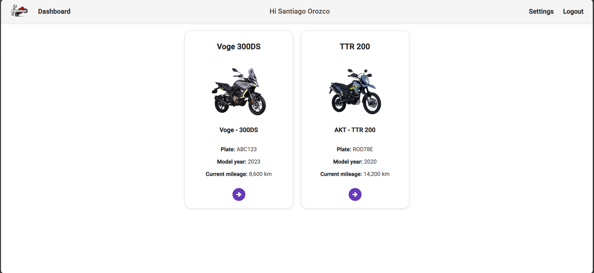
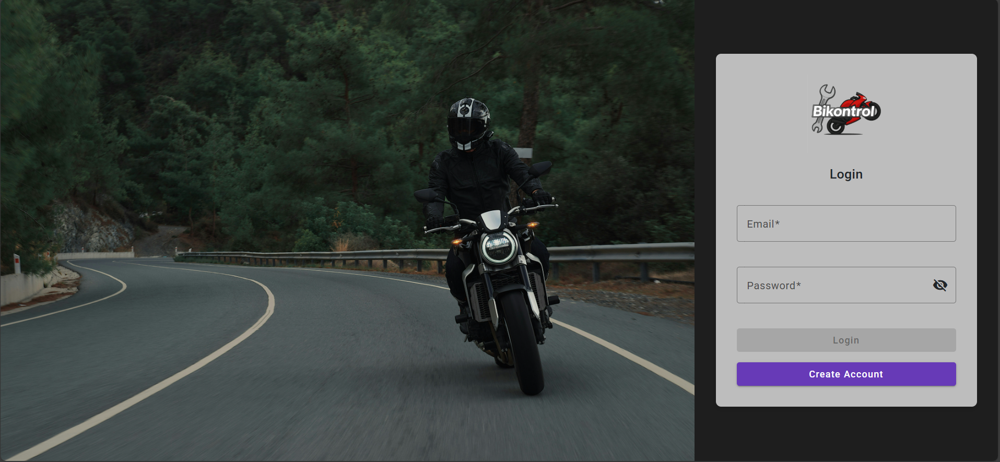

# Bikontrol 🛠🏍️

**Bikontrol** is a full-stack web application that helps motorcycle owners track and manage their maintenance tasks—from basic chain lubrication to advanced inspections.


---

## ✨ Features

- 🛠️ Register and categorize maintenance tasks
- 🔔 Track upcoming service reminders (planned)
- 🔐 Login system with JWT-based authentication
- ⚙️ Modular Clean Architecture project with distinct layers
- 📑 Database schema managed with SQL Server projects

> 🧪 Still in development – UI and core features are being built iteratively.

---

## 🏗️ Project Structure

The backend follows a Clean Architecture approach:

- `Bikontrol.API` → Entry point with controllers and API endpoints
- `Bikontrol.Application` → DTOs, interfaces, and application logic  
- `Bikontrol.Domain` → Core business entities
- `Bikontrol.Infrastructure` → External services, JWT generator, custom exceptions
- `Bikontrol.Persistence` → Repositories and EF Core DbContext implementation
- `Bikontrol.Shared` → (Reserved for future shared logic or constants) 
- `Bikontrol.Database` → SQL project for schema comparison and migrations

Frontend is an Angular 17 SPA located in the `/bikontrol-web` folder.

---

## 🛠 Tech Stack

- **Frontend**: Angular 17, Angular Material, Bootstrap
- **Backend**: ASP.NET Core 8, Clean Architecture, ADO.NET
- **Database**: SQL Server + SSDT (Database project)
- **Auth**: JWT (JSON Web Tokens)

---

## 🚀 Getting Started

### 🧩 Prerequisites

- Node.js 18+ and Angular CLI
- .NET 8 SDK
- SQL Server
- Visual Studio (for SSDT database project)

### ⚙️ Frontend

```bash
cd bikontrol-web
npm install
ng serve
```

### ⚙️ Backend

```bash
cd Bikontrol.API
dotnet restore
dotnet run
```

### 🔄 How to set up Schema Compare (optional)

If you want to use Visual Studio’s **Schema Compare** tool to compare and update the database:

1. Open the `Bikontrol.Database.sqlproj` project in **Visual Studio**.
2. Right-click the project → `Schema Compare...`.
3. In the left panel (Source), select:
   - `Database project`: `Bikontrol.Database`
4. In the right panel (Target), select:
   - `Database`: your local instance (e.g., `(localdb)\MSSQLLocalDB`)
5. Click `Compare` to view differences.
6. (Optional) Save the configuration locally via `Save As...`.

> ⚠️ The `.scmp` file is not included in the repository to avoid machine-specific conflicts

## 🖼️ Screenshots

### 🔹 Login Page  


### 🔹 Register Page  


### 🔹 Dashboard (Group Overview)  


